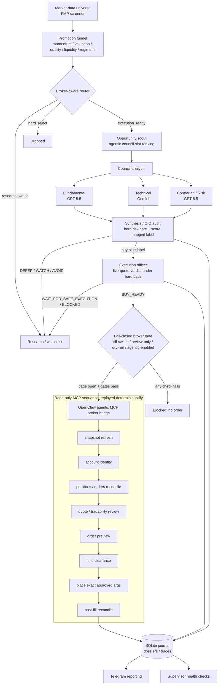

# Artha Council — Design Notes

Artha Council is a staged AI investment committee that turns a broad US-stock
universe into auditable, fail-closed execution decisions. Its central design
principle is the hard separation of **investment quality** ("is this company
worth owning?") from **execution feasibility** ("can this exact order be placed
safely right now?"), with a deterministic, fail-closed broker bridge sitting
between the reasoning layer and any money-moving step.

## Architecture / data flow

## Deep dive: quality-vs-execution separation and the fail-closed OpenClaw bridge

### The problem

A naive "AI stock picker" collapses two unrelated questions into one model
call. The reasoning model is asked to both judge a company *and* decide whether
to buy it, and the resulting decision is fired at a broker. That coupling is
where retail automation goes wrong: a genuinely good idea can still be an unsafe
*order* because the live quote moved, the spread blew out, the broker snapshot
is stale, the security is non-fractional, or a broker review raised a blocking
alert. Conversely, a clean, executable quote is worthless if the underlying
thesis is weak. Mixing the two means a single hallucinated number or an
optimistic LLM can move real money.

### The approach

Artha splits the pipeline into a **research layer** and an **execution layer**
that never share authority.

The research layer (`funnel.py` → `broker_router.py` → `opportunity_scout.py` →
`council.py`) produces only a *label*: `BUY`, `STARTER`, `TACTICAL_BUY`,
`DEFER`, `WATCH`, or `AVOID`. Three analysts run with no cross-contamination —
each gets its own model, prompt, and data slice (Fundamental=GPT-5.5,
Technical=Gemini, Contrarian/Risk=GPT-5.5). The synthesis/CIO layer reconciles
them under a key constraint encoded in `_min_risk_action`: the CIO can
*restrict* a recommendation below the score-mapped action but can **never
upgrade above it** (`_ACTION_RISK_ORDER` runs BUY → AVOID, and the final action
is the more conservative of the two). A binary hard-risk gate can veto outright.
Crucially, the router that decides executability is *deliberately
non-fundamental* — it lanes candidates into `execution_ready` / `research_watch`
/ `hard_reject` purely on quote freshness, spread, tradability, and
data-provider conflict, so an interesting-but-unexecutable name is preserved in
research, not silently traded or silently lost.

Only buy-side labels reach the **execution officer** (`execution_officer.py`),
which converts a label into a live-quote verdict — `BUY_READY`,
`WAIT_FOR_SAFE_EXECUTION`, or `BLOCKED` — under hard, non-overridable caps: a
no-chase cap (`reference_price * (1 + NO_CHASE_PCT)`), spread limits, and
buying-power checks. When the agentic officer is enabled, an LLM may *choose
among deterministic candidates* (whole-share limit vs. fractional market) but
cannot expand caps; `run_agentic_execution_officer` validates that the model
actually called the required live tools (`robinhood_get_quote`,
`robinhood_get_tradability`, `robinhood_review_order`), affirmed
`order_unchanged`, cleared a minimum confidence, and saw a passing review gate —
otherwise it returns `allow_place: False`.

### The fail-closed OpenClaw MCP bridge

Artha never calls broker MCP tools from its own scheduler. The OpenClaw agentic
runner owns the Robinhood tools; Artha owns the *sequence*. The bridge
(`robinhood_bridge.py`, `openclaw_robinhood_handler.py`) emits an exact
read-only MCP call sequence — snapshot refresh → account identity → positions/
orders reconciliation → quote/tradability review → order preview → final
clearance → place **only** with the exact approved `place_mcp_args` → post-fill
reconciliation — and replays the collected responses back into source-controlled
clearance logic. The instruction text is literal ("call `place_equity_order`
with exactly `place_mcp_args`"; "never invent order parameters"), so the
money-moving step is deterministic even though execution is agentic.

The bridge is fail-closed at every layer. `_auto_buy_authorization_gate` and the
`place` verb both block whenever `REVIEW_ONLY`, `DRY_RUN_ONLY`, kill-switch, or
`not AGENTIC_ENABLED` hold — and the public `.env.example` ships all four in the
safe position. Even with the cage open, placement re-validates a fresh broker
snapshot (`evaluate_broker_snapshot_guardrails`), re-checks the stored review
gate, blocks fractional/market orders outside regular hours, and stamps a
deterministic idempotent `ref_id`. Any exception anywhere defaults to
`{"passed": False, "BLOCKED"}`.

### The trade-off

This safety cage costs *latency and slots*. Every order pays for a full
read-only snapshot/preview round-trip before placement, scarce council slots are
spent only on `execution_ready` names, and a moved quote yields no fill rather
than a chased one. The deliberate bet is that for a tightly capped pilot account,
a missed trade is strictly cheaper than an unsafe one — so Artha optimizes for
auditability and fail-closed correctness over fill rate or reaction speed.